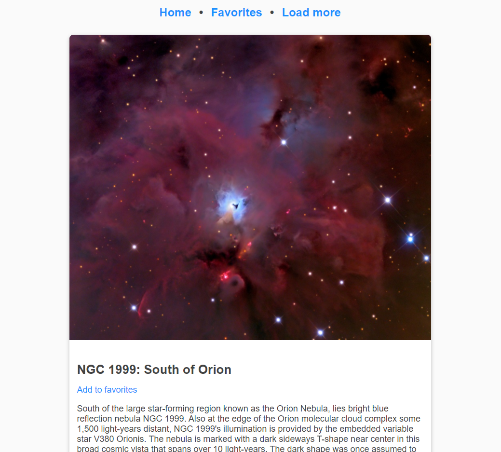

# Nasa Api Pictures 📝

An App using the nasa API to fetch some [NASA's picture of the day](https://apod.nasa.gov/apod/astropix.html) and save some pictures that you like

# Motivation

This idea came out from [JavaScript Web Projects: 20 Projects to Build Your Portfolio](https://academy.zerotomastery.io/p/javascript-projects)  
Project 16 of 20

# Screenshot



# Tools
* [React](https://es.reactjs.org/) - Framework
* [styled-components](https://styled-components.com/) - Alternative to CSS
* [react-fetch-hook](https://www.npmjs.com/package/react-fetch-hook) - Hook for conveniently use Fetch API
* [NASA's picture of the day API](https://api.nasa.gov/) - For getting their awesome pictures

# Deployment

[Vercel](https://nasa-api-pictures.vercel.app/)

# To run this app
1. Clone this repo
2. Run ```npm install```
3. Run ```npm start```
